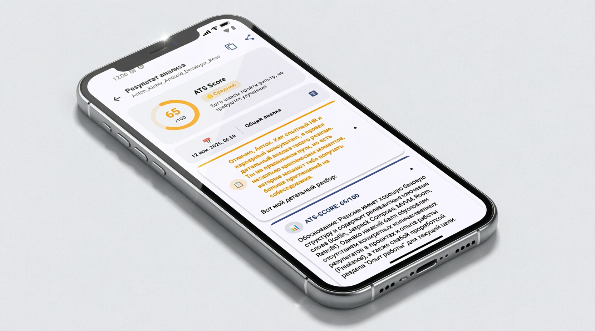
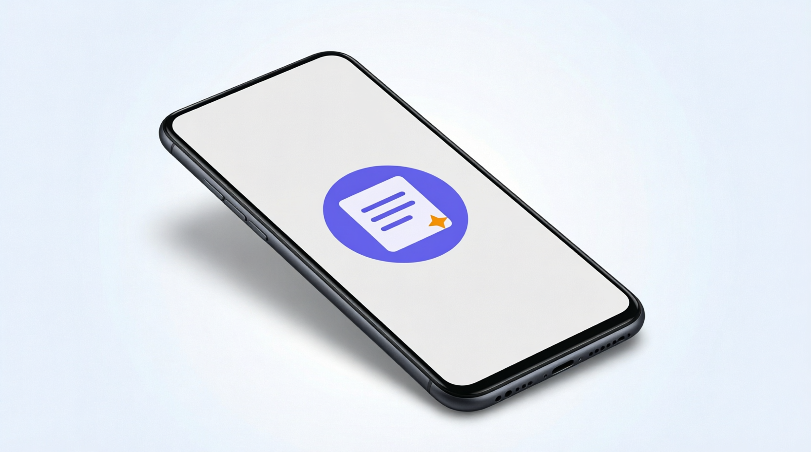
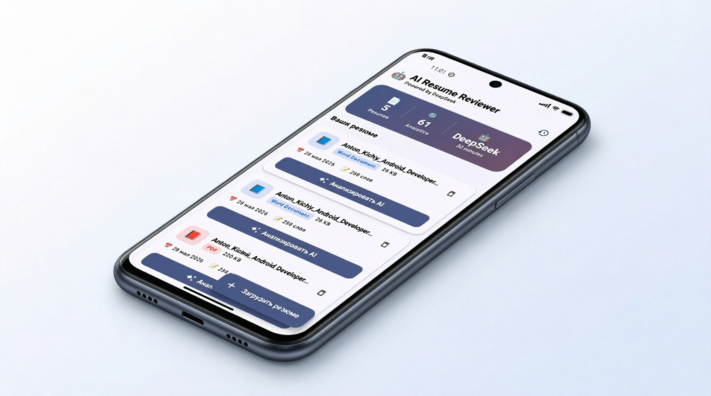
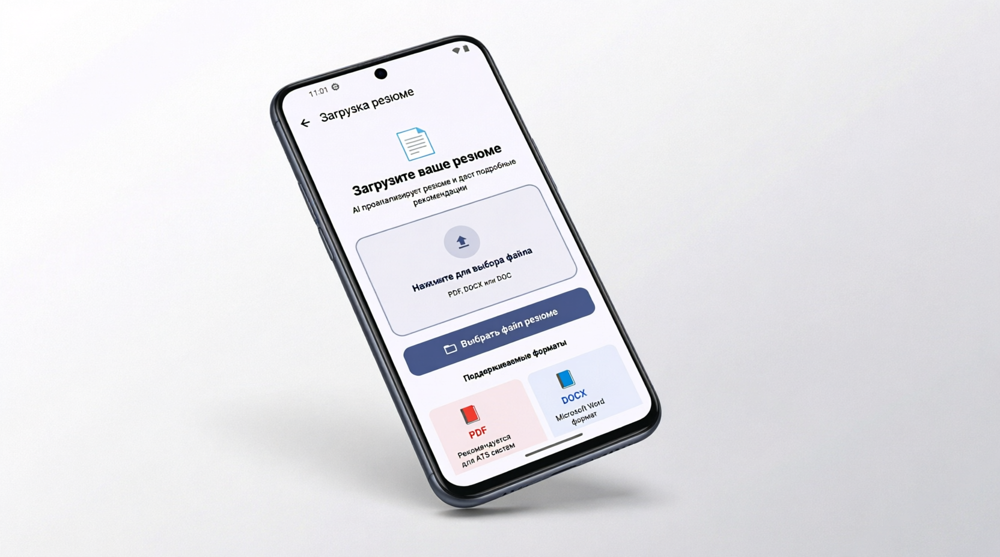
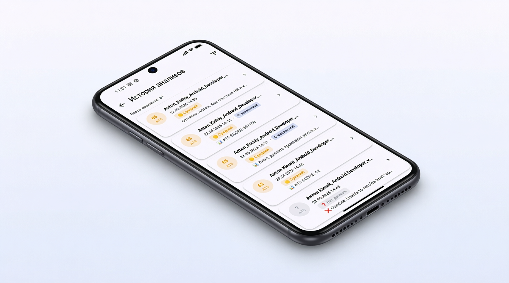

# AufffAiResumeReviewer 📄

AI-powered resume review Android application

## 📱 Описание

Приложение для анализа резюме с использованием искусственного интеллекта.

## ✨ Возможности

- Анализ структуры резюме
- ATS оценка резюме (0-100)
- Слабые места и ошибки
- Рекомендации по улучшению
- Адаптация под вакансию
- Ключевые слова для ATS

### Рекомендации

##  Установка

[Скачать APK](https://drive.google.com/file/d/12ceBivNimtY0GvmH9tT7HAVZcjRctaz7/view?usp=sharing)

## 📋 Требования

- Android 8.0+
- Интернет-соединение

## 📸 Скриншоты

### Splash screen

### Главный экран

### Анализ резюме

### История анализов 

## 📄 Лицензия

MIT License
